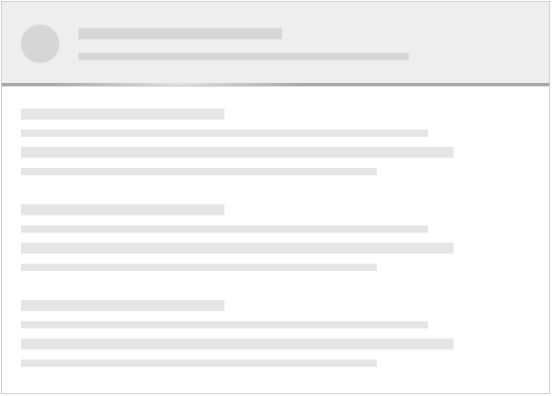

# jquery-skeleton
Show skeleton screen during asynchronous data loading

### Usage

#### Html fragment:

```html
<article class="wrapper">
  <header></header>
  <main></main>
</article>
```

#### jQuery plugin:

```javascript
$('.wrapper').avnSkeleton({
  cssPrefix: 'avn-skeleton',
  header: {
    selector: '> header',
    lines: 2,
    icon: true,
    loader: true
  },
  main: {
    selector: '> main',
    paragraphs: 3,
    lines: 4
  }
});
```

#### Plugin methods:

```javascript
// Remove the skeleton when real content is available
$('.wrapper').avnSkeleton('remove');

// Display again the skeleton
$('.wrapper').avnSkeleton('display');
```

### Installation and build

```shell
npm install
npm run build
```

### Open a local server

```shell
npm start
```

### Screenshot


